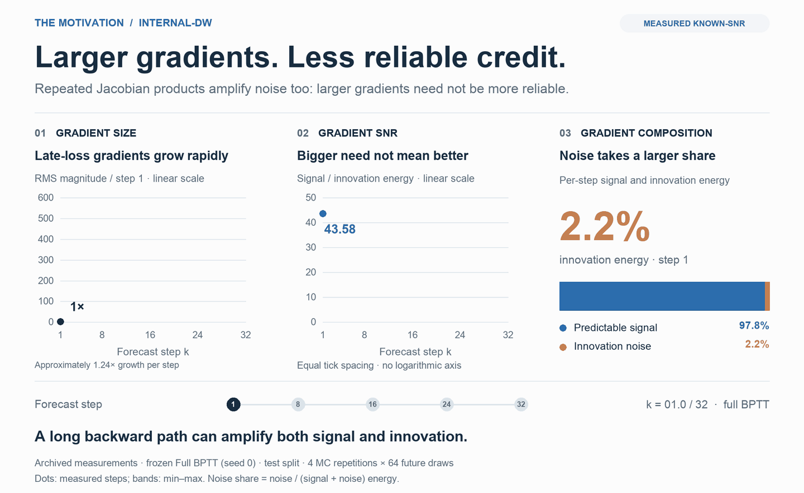
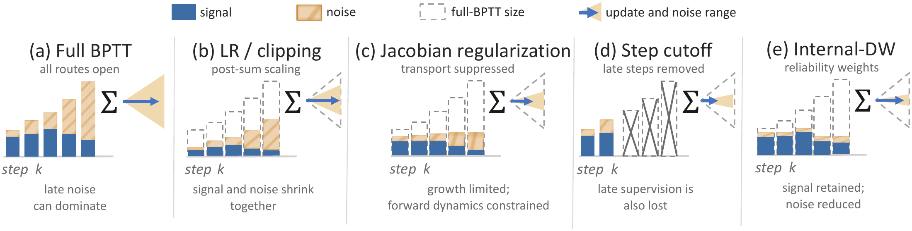
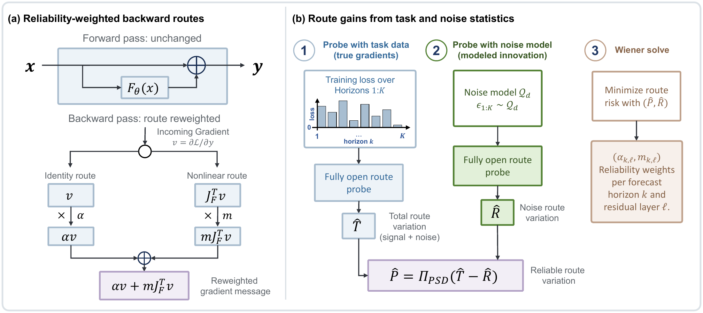
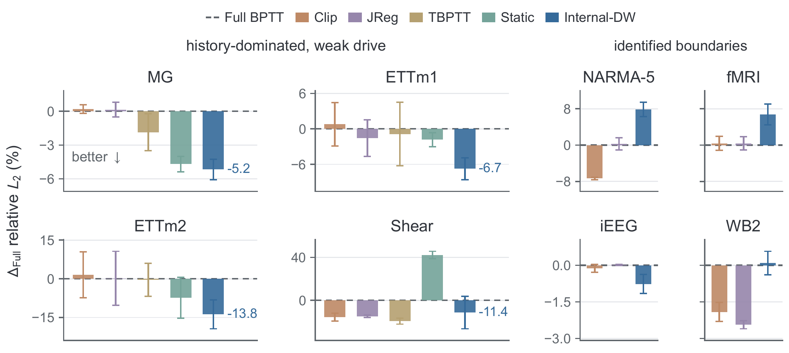

<div align="center">

# Large Distant Gradients Need Not Be Reliable
### reliability-weighted credit assignment for long-horizon autoregressive forecasting

**Junhao Zhao · David Michael Simberg · Jacob Kang · Colin Connor Kurniawan · Nan Xu**

[](https://arxiv.org/abs/2609.12890v2)
[](pyproject.toml)
[](pyproject.toml)
[](LICENSE)

[Paper](https://arxiv.org/abs/2609.12890v2) · [Quick start](#quick-start) · [Results](#results) · [Reproduction](docs/REPRODUCING.md) · [API](docs/INTERNAL_DW_API.md) · [Citation](#citation)

</div>

**Official research code for Internal Dual-Wiener routing (Internal-DW).**



*Known-SNR measurements from a frozen Full-BPTT model: four Monte Carlo repetitions,
64 future-noise draws each. Noise percentage is measured per forecast step.*
[Static version](docs/assets/known-snr-motivation.png) · [Data and provenance](docs/assets/README.md#known-snr-motivation-animation)

## Why reliability-weighted gradients?

Distant losses pass through repeated Jacobian products. Their gradients can
grow while amplifying both predictable signal and unpredictable variation;
gradient magnitude alone does not measure useful learning signal. Internal-DW
weights contributions inside residual blocks before they accumulate into the update.

<details>
<summary><strong>Visual comparison with clipping, Jacobian regularization, and truncation</strong></summary>



*Figure 1 from the paper. Each route weight scales signal and innovation together;
the two components are not separately observed in application data.*

</details>

## Method

**Internal-DW** is a backward-only intervention for residual autoregressive models. It preserves
the full forward rollout and every step loss, while weighting the identity and
nonlinear gradient routes by their estimated reliability.

> Retaining long-horizon supervision does not require trusting every backward contribution equally.



*Figure 2 from the paper. Route gains are calibrated for each forecast horizon and residual layer.*

| What Internal-DW provides | How it works |
|---|---|
| **Full forward rollout** | Keeps predictions and all per-step losses unchanged. |
| **Separate route gains** | Applies bounded Wiener gains to the identity and nonlinear backward routes. |
| **Automatic calibration** | Estimates gains from route-level gradient statistics and an explicit noise model. |
| **A reusable PyTorch operator** | Exposes `InternalDW` and `InternalDWResidual`, with a runnable integration example. |

## Results

Internal-DW reduces forecast error by **5.2–13.8% relative to full BPTT** on the
four history-dominated, weak-drive testbeds. It also extends or preserves the
fitted optimal training-horizon range on these four datasets.



*Figure 6 from the paper. Negative values indicate improvement; error bars show
standard deviations across three matched seeds.*

<details>
<summary><strong>Numerical results on the four history-dominated, weak-drive testbeds</strong></summary>

Dense-horizon test relative L2, **mean ± sample SD over three matched seeds**.
Lower is better; bold marks the best mean in each column. Compare values within
each dataset, since normalization is dataset-specific.

| Method | Mackey–Glass | ETTm1 | ETTm2 | Shear flow |
|---|---:|---:|---:|---:|
| Full BPTT | 1.0541 ± 0.0044 | 0.9422 ± 0.0252 | 0.8684 ± 0.0913 | 0.1639 ± 0.0354 |
| Clip | 1.0563 ± 0.0040 | 0.9497 ± 0.0348 | 0.8817 ± 0.0771 | 0.1383 ± 0.0060 |
| JReg | 1.0556 ± 0.0069 | 0.9274 ± 0.0293 | 0.8700 ± 0.0910 | 0.1397 ± 0.0021 |
| TBPTT | 1.0344 ± 0.0172 | 0.9340 ± 0.0508 | 0.8650 ± 0.0552 | **0.1322 ± 0.0046** |
| Static | 1.0047 ± 0.0073 | 0.9250 ± 0.0113 | 0.8043 ± 0.0686 | 0.2330 ± 0.0057 |
| **Internal-DW** | **0.9997 ± 0.0096** | **0.8786 ± 0.0176** | **0.7489 ± 0.0489** | 0.1452 ± 0.0247 |

Source: the paper's appendix table of dense-horizon relative-L2 values underlying Figure 6.

</details>

**Applicability matters.** Benefits diminish or reverse when usable history is
limited or the selected noise sampler misses dominant drive-dependent variation.
The paper reports worse forecasting on NARMA-5 and movie fMRI, and comparable
performance on iEEG and WeatherBench-2. See the [paper](https://arxiv.org/abs/2609.12890v2)
for the controlled known-SNR experiment, uncertainty analysis, and regime diagnostics.

## Installation

Clone the repository and run commands from its root:

```bash
git clone https://github.com/inspirelab-site/Internal-DW.git
cd Internal-DW
```

The reusable operator requires **Python 3.10+**, **NumPy**, and **PyTorch 2.1+**.
For the paper experiments, use the recorded Python 3.11 / PyTorch 2.7.1 setup
on a CUDA-capable Linux host:

```bash
conda create -n internal-dw python=3.11 pip -y
conda activate internal-dw
python -m pip install --upgrade pip
python -m pip install torch==2.7.1 --index-url https://download.pytorch.org/whl/cu118
python scripts/utils/check_install.py --require-conda --require-cuda && \
python -m pip install -e ".[paper,test]" && \
python -m pip check && \
bash scripts/reproduce/00_smoke_test.sh
```

<details>
<summary><strong>Minimal operator install / CPU example</strong></summary>

With a compatible Python environment and PyTorch installation:

```bash
python -m pip install -e .
python examples/quickstart_internal_dw.py
```

The `paper` extra adds scientific-data, plotting, and tabular dependencies;
the `test` extra adds pytest. The small integration example runs on CPU.

</details>

## Quick start

### Try the operator

```bash
python examples/quickstart_internal_dw.py
```

This self-contained example trains a small residual forecaster on generated
tensors and prints losses and route gains. To integrate the operator, route
the input **before** the residual branch:

```python
from internal_dw import InternalDW

dw = InternalDW(
    state_dim=hidden_size,
    num_layers=num_residual_blocks,
    max_horizon=training_horizon,
)

def residual_block(x, horizon, layer, nonlinear):
    skip_x, branch_x = dw.route(x, horizon=horizon, layer=layer)
    return skip_x + nonlinear(branch_x)
```

Both outputs have the exact forward values of `x`. Their backward messages
receive separate gains; local parameter gradients inside `nonlinear` remain open.
Training also requires the batch lifecycle: `begin_batch()`, per-step
`observe()`, `calibrate()`, `loss.backward()`, and `end_batch()` before the optimizer
step. Follow the [complete example](examples/quickstart_internal_dw.py) or the
[API contract](docs/INTERNAL_DW_API.md) for the full loop and noise-model configuration.

### Train and test on Mackey–Glass

Run the two matched arms on one GPU; synthetic data is generated locally:

```bash
ARM=full_bptt SEED=0 GPU=0 bash scripts/reproduce/train_test_mg.sh
ARM=internal_dw SEED=0 GPU=0 bash scripts/reproduce/train_test_mg.sh
```

Each command trains with validation-based checkpoint selection, then evaluates
`best.pth` on the test split. The launcher prints checkpoint and test-JSON paths;
read `primary_metric.value` in the test JSON for mean relative L2 over horizons 1–48.
Append `train` or `test` to run either stage independently.

For multiple GPUs, first run `python scripts/utils/check_ddp_cuda.py`, then use
`GPUS=0,1,2,3` instead of `GPU=0`. The MG launcher preserves the canonical global
microbatch and gradient-accumulation schedule.

## Reproduce the paper

Training produces validation-selected checkpoints, testing produces compact
result JSON files, and rendering consumes completed results. The numbered
figure scripts **do not launch training**.

| Goal | Entry point | Prerequisites |
|---|---|---|
| Check installation and public API | `bash scripts/reproduce/00_smoke_test.sh` | Install with `paper,test` extras |
| Run known-SNR experiment | `GPU=0 bash scripts/reproduce/train_test_known_snr.sh` | One GPU; generates its own data |
| Run all eight Figure 6 datasets | `GPU=0 bash scripts/reproduce/train_test_figure6_all.sh` | Prepare external datasets first |
| Repeat Clip/JReg selection | `GPUS=0,1,2,3 bash scripts/reproduce/sweep_clip_jreg.sh` | Prepared data; independent single-GPU jobs |
| Render Figure 6 | `bash scripts/reproduce/05_figure_6.sh` | Completed benchmark test records |
| Render all paper items | `bash scripts/reproduce/render_all.sh` | Required result/probe ledgers |
| Run the test suite | `python -m pytest -q` | Install with `paper,test` extras |

**Data:** MG, NARMA, and known-SNR data are generated locally. ETTm1/ETTm2,
movie iEEG, HCP movie fMRI, The Well shear flow, and WeatherBench-2 require
upstream data and preparation. Large datasets, checkpoints, and result ledgers
are not stored in Git. The figures displayed above are bundled paper illustrations.

For dataset preparation, iEEG cohort runs, resume behavior, and output paths,
follow the [reproduction guide](docs/REPRODUCING.md).
All public launchers use repository-relative defaults; configure external
storage through [environment variables](docs/REPRODUCING.md#path-configuration-no-script-editing-required).

## Documentation and code

| Resource | What you will find |
|---|---|
| [Reproduction guide](docs/REPRODUCING.md) | Detailed training, testing, probes, rendering, and path configuration |
| [Data formats](docs/DATA_FORMATS.md) | Preparation commands, dataset layouts, array keys, and shapes |
| [Public API](docs/INTERNAL_DW_API.md) | Routing, calibration, noise samplers, diagnostics, and state |
| [Paper-to-code index](docs/PAPER_CODE_INDEX.md) | Figure/table mappings to implementations and result ledgers |
| [Canonical configurations](configs/reproduce/README.md) | Recorded paper settings and override behavior |
| [Script directory guide](scripts/README.md) | Data, training, evaluation, probes, plotting, and result assembly |

```text
src/internal_dw/       Public operator, models, datasets, training, evaluation
examples/              Minimal integration in a residual forecaster
configs/reproduce/     Canonical experiment settings
scripts/reproduce/     Stable train/test and figure/table entry points
tests/                 Numerical and integration tests
docs/                  API, data contracts, reproduction guide, paper figures
```

## Citation

If you use this code or build on the method, please cite the [paper](https://arxiv.org/abs/2609.12890v2):

```bibtex
@article{zhao2026large,
  title={Large Distant Gradients Need Not Be Reliable: reliability-weighted credit assignment for long-horizon autoregressive forecasting},
  author={Zhao, Junhao and Simberg, David Michael and Kang, Jacob and Kurniawan, Colin Connor and Xu, Nan},
  journal={arXiv preprint arXiv:2609.12890},
  year={2026}
}
```

Released under the [MIT License](LICENSE).
